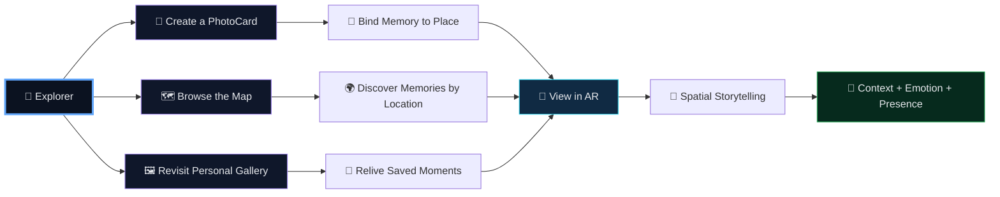
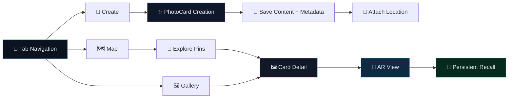
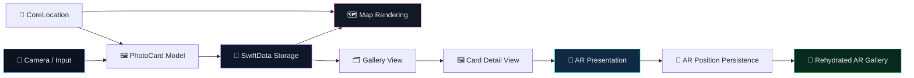

<!-- ===================================================== -->
<!--   DropSpot — README.md (Premium Interactive)          -->
<!--   Classy • Visual • Interactive • Recruiter-Ready     -->
<!-- ===================================================== -->

<div align="center">

<p align="center">
  
</p>

<br/>


<br/><br/>

<a href="#-project-overview"><b>Overview</b></a> •
<a href="#-problem-space"><b>Problem</b></a> •
<a href="#-experience-architecture"><b>Architecture</b></a> •
<a href="#-dropspot-experience-universe"><b>Experience Universe</b></a> •
<a href="#-technical-highlights"><b>Tech</b></a> •
<a href="#-why-this-project-matters"><b>Impact</b></a> •
<a href="#-contact"><b>Contact</b></a>

</div>

---

## 🌍 Project Overview

**DropSpot** is a **location-based AR social platform** that lets users create, save, discover, and relive memories through **PhotoCards** connected to real-world places.

Instead of storing media as flat content inside a traditional gallery, DropSpot transforms photos into **location-aware digital experiences** that can be explored through:

- 📸 PhotoCard creation  
- 📍 Place-linked memories  
- 🗺 Map-based discovery  
- 🧠 Augmented reality visualization  
- 🖼 Personal gallery recall  

It is a project built at the intersection of **social experience design**, **spatial computing**, and **immersive storytelling**.

---

## 🧩 Problem Space

Most photo-sharing products separate **media** from **place**.

That means:
- memories are stored, but not spatially experienced
- photos lose their physical context
- discovery becomes feed-based instead of environment-based
- emotional recall is weaker because the “where” disappears

**DropSpot** addresses this by binding digital memories to the physical world.

This enables:
- 📍 place-aware memory recall  
- 🧠 stronger emotional context  
- 🌐 spatial storytelling  
- ✨ a more immersive social interaction model  

---

## 🧠 Experience Architecture

<details open>
<summary><b>🛰 From Capture to Spatial Experience (click to collapse)</b></summary>
<br/>


</details>

---

## 🌌 DropSpot Experience Universe

<details open>
<summary><b>✨ Explore the product as an experience system (click to collapse)</b></summary>
<br/>



</details>

<div align="center">

<table>
<tr>
<td width="33%" align="center" valign="top">

### 📸 Create
Users capture or build a PhotoCard, turning a moment into a shareable memory artifact.


</td>

<td width="33%" align="center" valign="top">

### 📍 Place
Each memory is tied to physical location, giving the content spatial relevance and context.


</td>

<td width="33%" align="center" valign="top">

### 🧠 Relive
The experience can be rediscovered through maps, galleries, and AR-based spatial recall.


</td>
</tr>
</table>

</div>

---

## 🎭 Interactive Product Modes

<details>
<summary><b>📲 DropSpot is not one interface — it is three connected modes (click to expand)</b></summary>
<br/>

### 🗺 Map Mode
- Discover memories through geographic context
- Navigate through pinned content
- Experience place as an entry point

### 📸 Creation Mode
- Capture a moment
- Turn it into a PhotoCard
- Attach metadata and location

### 🧠 AR Mode
- Project digital content into physical space
- Revisit saved placements
- Experience memory through immersion rather than scrolling

</details>

---

## 🔬 Product Interaction Framework

<details open>
<summary><b>📲 User interaction journey (click to collapse)</b></summary>
<br/>



</details>

---

## 🎯 Premium Feature Themes

<div align="center">

<table>
<tr>
<td width="33%" align="center" valign="top">

### 📸 PhotoCard Creation
- Capture visual moments  
- Create memory artifacts  
- Store rich visual context  


</td>

<td width="33%" align="center" valign="top">

### 🗺 Location Discovery
- Pin content to coordinates  
- Explore by geography  
- Turn the map into an interface  


</td>

<td width="33%" align="center" valign="top">

### 🧠 Persistent AR
- Place cards in space  
- Reload saved positions  
- Connect digital memory with physical presence  


</td>
</tr>
</table>

</div>

---

## 🧠 Architecture Intelligence Model

<details open>
<summary><b>⚙️ System design thinking (click to collapse)</b></summary>
<br/>



</details>

---

## 🏗 Architecture Decisions

<div align="center">

<table>
<tr>
<td width="33%" align="center" valign="top">

### 📱 SwiftUI-First UI
- Declarative interface  
- Clean navigation patterns  
- Fast product iteration  


</td>

<td width="33%" align="center" valign="top">

### 💾 Local-First Persistence
- SwiftData-backed storage  
- Fast local access  
- Strong offline-friendly behavior  


</td>

<td width="33%" align="center" valign="top">

### 🌐 Spatial Experience Layer
- ARKit + RealityKit integration  
- Real-world anchor thinking  
- Digital content with physical context  


</td>
</tr>
</table>

</div>

---

## 📦 Technical Highlights

- Built with **SwiftUI** for modern declarative UI
- Uses **SwiftData** for local PhotoCard persistence
- Integrates **MapKit** for map-based memory discovery
- Uses **CoreLocation** to bind content to real-world coordinates
- Supports **ARKit + RealityKit** for immersive card visualization
- Includes **AR position persistence** to reload spatial placements
- Multi-view experience across:
  - map exploration
  - card creation
  - detail interaction
  - AR presentation
  - gallery browsing

---

## 📂 Project Structure

```bash
DropSpot/
├── dropspot_/
│   ├── ContentView.swift            # Main tab-based shell
│   ├── MapTabView.swift             # Map discovery experience
│   ├── Addcards.swift               # PhotoCard creation flow
│   ├── CameraView.swift             # Camera integration
│   ├── modelsphotocard.swift        # Core PhotoCard model
│   ├── carddetailview.swift         # Detailed card interface
│   ├── ArCardView.swift             # AR single-card experience
│   ├── ARGalleryView.swift          # Restored AR gallery view
│   ├── ARCardPersistence.swift      # Spatial transform persistence
│   ├── LocationManager.swift        # GPS / location logic
│   ├── PolaroidBuilder.swift        # Card styling and composition
│   ├── Extensions.swift             # Utility extensions
│   └── babyApp.swift                # App entry point
├── Assets/                          # Characters and image assets
├── PRIVACY_POLICY.md
└── LICENSE
```

---

## 🚀 Future Expansion Path

<details open>
<summary><b>🔮 From memory app to spatial social platform (click to collapse)</b></summary>
<br/>


</details>

---

## 🌟 Why This Project Matters

<div align="center">

<table>
<tr>
<td width="33%" align="center" valign="top">

### 🧠 Product Thinking
- Turns media into experience  
- Builds emotional + spatial value  
- Strong user-story foundation  


</td>

<td width="33%" align="center" valign="top">

### ⚙️ Engineering Depth
- Cross-framework integration  
- UI + data + maps + AR coordination  
- Rich interaction complexity  


</td>

<td width="33%" align="center" valign="top">

### 🚀 Future Relevance
- Strong Apple ecosystem alignment  
- Spatial computing foundation  
- Expandable into social + AI systems  


</td>
</tr>
</table>

</div>

---

## 🧪 Core Concepts Demonstrated

- spatial UX design  
- location-aware content systems  
- persistent augmented reality  
- declarative iOS architecture  
- real-world memory mapping  
- immersive interaction design  

---

## 🤝 Contact

<div align="center">

<a href="https://www.linkedin.com/in/navyashree-byregowda-472821196/">
  
</a>

<a href="https://github.com/Navyagowda2714">
  
</a>

<a href="mailto:navyashreebyregowda@gmail.com">
  
</a>

<br/><br/>
<sub>DropSpot — where places become living digital memory spaces.</sub>

</div>
